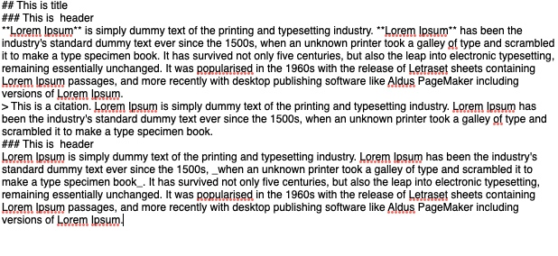
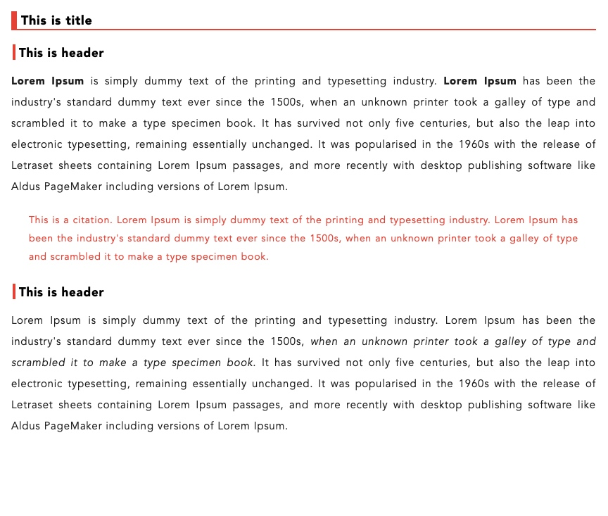

# CSS-templates-for-WeChat
This repository stores CSS templates to decorate your article.

The workflow I recommend is:
1. Write your article using [Markdown](https://en.wikipedia.org/wiki/Markdown) markup
2. Choose a text editor which can convert Markdown to HTML
3. Use the CSS template for styling this HTML

For text editor application I recommend something like Ulysses. In this way when you type your words like this:

You can get this in one click:

Much prettier!